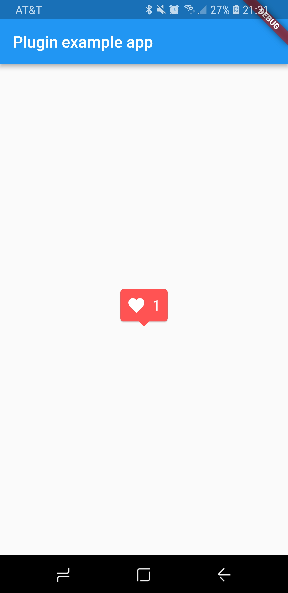
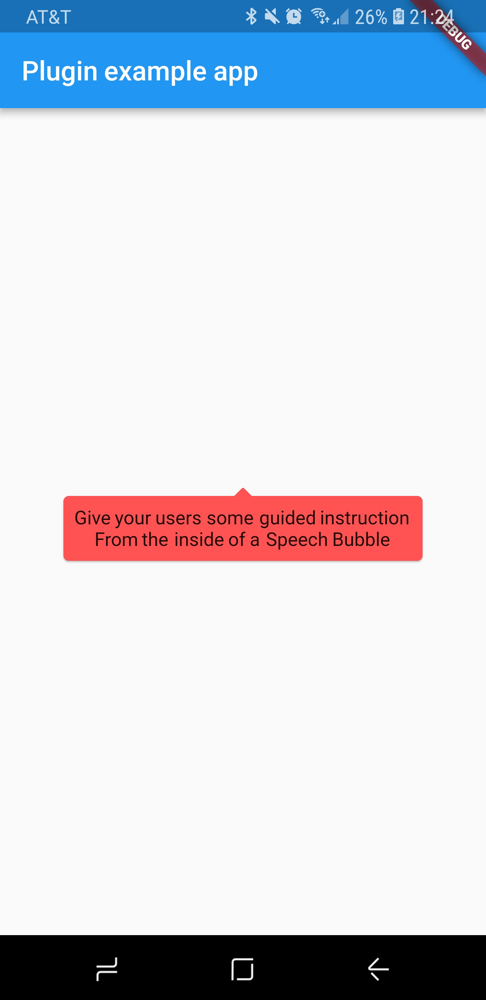

# SpeechBubble

A flutter widget that emulates a speech bubble.

This widget is modeled after the red Instagram notification popups.


<div class="center">
    
  </div>

# Installing

Dart Pub: https://pub.dartlang.org/packages/speech_bubble#-installing-tab-

1. Depend on it

   Add this to your package's pubspec.yaml file:

```dependencies:
  speech_bubble: ^0.0.1
```

2. Install it

   You can install packages from the command line:

```
$ flutter packages get
```

Alternatively, your editor might support flutter packages get. Check the docs for your editor to learn more.

3. Import it

   Now in your Dart code, you can use:

```
import 'package:speech_bubble/speech_bubble.dart';
```

# Usage

Creates a widget that emulates a speech bubble.
Could be used for a tooltip, or as a pop-up notification, etc.

<div class="center">
    
  </div>

# Properties

- child -> Widget

The child contained by the SpeechBubble.

- nipLocation -> NipLocation

The location of the nip of the speech bubble.
Use the NipLocation enum, either TOP, RIGHT, BOTTOM, or LEFT.
The nip will automatically center to the side that it is assigned.

- color -> Color

The color of the body of the SpeechBubble and nip.
Defaultly red.

- borderRadius -> double

The borderRadius of the SpeechBubble.
The SpeechBubble is built with a circular border radius on all 4 corners.

- height -> double

The explicitly defined height of the SpeechBubble.
The SpeechBubble will defaultly enclose its child.

- width -> double

The explicitly defined width of the SpeechBubble.
The SpeechBubble will defaultly enclose its child.

- padding -> Widget

The padding widget between the child and the edges of the SpeechBubble.

# Example Code

```dart
import 'package:flutter/material.dart';
import 'package:speech_bubble/speech_bubble.dart';

void main() => runApp(new MyApp());

class MyApp extends StatefulWidget {
  @override
  _MyAppState createState() => new _MyAppState();
}

class _MyAppState extends State<MyApp> {
  @override
  Widget build(BuildContext context) {
    return new MaterialApp(
      home: new Scaffold(
        appBar: new AppBar(
          title: const Text('Plugin example app'),
        ),
        body: new Center(
          child: new SpeechBubble(
            nipLocation: NipLocation.BOTTOM,
            // child: Column(
            //   mainAxisSize: MainAxisSize.min,
            //   children: <Widget>[
            //     Text("Give your users some guided instruction"),
            //     Text("From the inside of a Speech Bubble")
            //   ],
            // ),
            child: Row(
              mainAxisSize: MainAxisSize.min,
              children: <Widget>[
                Icon(
                  Icons.favorite,
                  color: Colors.white,
                ),
                Padding(
                  padding: const EdgeInsets.all(4.0),
                ),
                Text(
                  "1",
                  style: TextStyle(
                    color: Colors.white,
                    fontSize: 18.0,
                  ),
                ),
              ],
            ),
          ),
        ),
      ),
    );
  }
}
```
